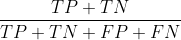
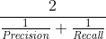
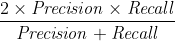

# Evaluation
모델 성능 평가 지표

# 평가 기준
이진 분류에서 성능 지표로 잘 활용되는 오차행렬 사용

# 평가 지표
## 입력 값
- P : 전체 참인 수
- N : 전체 거짓인 수

- TP (True Positive) : 참을 참이라고 한 횟수
- TN (True Negative) : 거짓을 거짓이라고 한 횟수
- FN (False Negative) : 참을 거짓이라고 한 횟수  
- FP (False Positive) : 거짓을 참이라고 한 횟수  

## 계산식
- Accuracy : 정확도, 제대로 분류된 데이터의 비율 
  -   
  

- Error Rate : 오류율, 잘못 분류한 데이터의 비율 
  -   
  

- Precision : 정밀도, 예측한 정답 중 실제 정답인 것
  - 모델 관점
  -   
  

- recall : 재현율, 실제 정답 중 예측에 성공한 것 
  - 데이터 관점
  - 참인 정답이 적을 때 유효
  -   
  

- F1-Score : Precision과 Recall의 조화평균, 
  - recall과 precision의 조화 평균
  - 
  -   
  

- Geometric Mean : 균형 정확도
  - 참에 대한 정확도와, 거짓에 대한 정확도를 따로 분류해 기하 평균을 구함 
  -   
  

